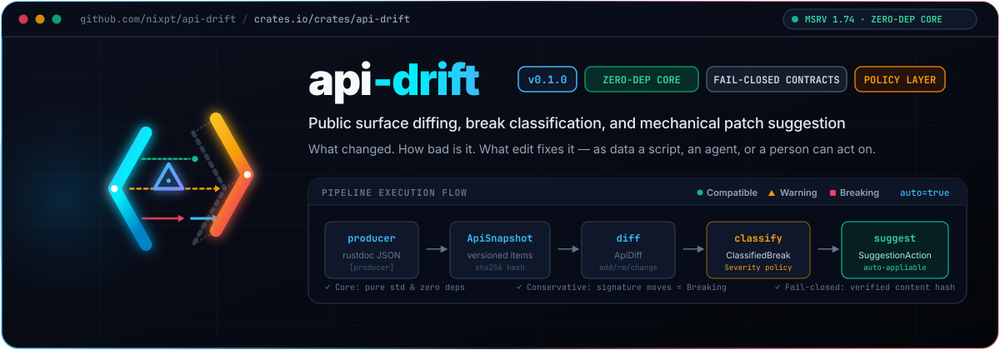

# api-drift

<p align="center">
  
</p>

Snapshot a Rust crate's public surface, diff two versions, classify each
change by how badly it breaks a downstream, and suggest the mechanical edit
that fixes it.

When a shared crate moves an API (rename, new required argument, removed
item), every consumer breaks and someone hand-edits every call site.
api-drift is the policy and type layer for that loop: **what changed, how bad
is it, what edit fixes it**, as data a script, an agent, or a person can act
on.

- Core is pure std with zero dependencies and no I/O.
- Opt-in `producer` feature reads rustdoc JSON into a snapshot.
- Opt-in `serde` feature serializes everything and defines a committed
  snapshot file format with a verified content hash.
- Conservative by design: signature changes are Breaking unless proven
  source-compatible, and only edits a script could apply without judgment are
  marked auto-appliable.

Status: 0.1.0, early. The API may still move between minor versions.

## Quick start

```toml
[dependencies]
api-drift = "0.1"
```

```rust
use api_drift::{
    snapshot::{ApiSnapshot, Item, ItemKind},
    diff::diff_snapshots,
    classify::classify_diff,
    suggest::suggest_for_breaks,
};

let old = ApiSnapshot::new("widgets 0.2.98", vec![
    Item::new("widgets::Alert::new", ItemKind::Function, "pub fn new(message: &str) -> Self"),
    Item::new("widgets::badge", ItemKind::Function, "pub fn badge(label: &str) -> Badge"),
]);
let new = ApiSnapshot::new("widgets 0.2.99", vec![
    Item::new("widgets::Alert::new", ItemKind::Function, "pub fn new(message: impl Into<String>) -> Self"),
    Item::new("widgets::tag", ItemKind::Function, "pub fn tag(label: &str) -> Badge"),
]);

let diff = diff_snapshots(&old, &new);   // added / removed / changed, sorted by path
let breaks = classify_diff(&diff);       // + BreakKind, Severity, item kind
let fixes = suggest_for_breaks(&breaks); // structured SuggestionAction per break

for s in &fixes {
    println!("{} {:?} auto={}", s.path, s.action, s.auto_appliable);
}
// widgets::Alert::new  ReviewSignature { old, new }     auto=false  (Compatible: widening)
// widgets::tag         RenameCall { from: widgets::badge, to: widgets::tag }  auto=true
```

## Pipeline

```text
producer ──▶ ApiSnapshot ──▶ diff ──▶ classify ──▶ suggest ──▶ consumer
rustdoc JSON    versioned      ApiDiff   ClassifiedBreak  Suggestion   codemod / agent / human
(feature        inventory      added     BreakKind        SuggestionAction
 `producer`)                   removed   Severity         auto_appliable
                               changed   item kind
```

### Severity rules

| Change | Severity | Why |
|---|---|---|
| item added | Compatible | nothing downstream references it yet |
| enum variant or struct field added | Warning | exhaustive matches and struct literals break; Compatible if the parent is `non_exhaustive` or the item is `deprecated` |
| item removed | Breaking | references stop resolving |
| function or method signature changed | Breaking | Rust has no default arguments; Compatible only when the change matches the widening allowlist (`&str` → `impl Into<String>`, `&T` → `impl AsRef<T>`, …) |
| other kinds, signature changed | Warning | shape moved, may still compile |
| item kind changed (struct → enum, …) | Breaking | usage must be reworked |

### Suggestions

| `SuggestionAction` | When | Auto-appliable |
|---|---|---|
| `RenameCall { from, to }` | removed + added under the same parent, same kind, identical signature modulo the leaf name | yes |
| `ReviewRename { from, to }` | same, but only a name-similarity signal | no |
| `AddMatchArm { enum_path, variant }` | new enum variant | no |
| `ReviewField { field }` | new struct field | no |
| `ReviewSignature { old, new }` | same path, new signature | no |
| `ReviewKind` | same path, new item kind | no |
| `RemoveItem` | item removed with no rename candidate | no |
| `NoOp` | pure addition | yes |

## Producer (`producer` feature)

```sh
cargo +nightly rustdoc -- -Z unstable-options --output-format json
```

```rust,ignore
let snap = api_drift::producer::snapshot_from_rustdoc_json(
    std::path::Path::new("target/doc/widgets.json"),
    "widgets 0.2.99",
)?;
```

Only in-crate public items become `Item`s; the signature string is the
compact `inner` JSON of the rustdoc node, so any semantic move changes it.
Unknown node shapes are skipped rather than failing, so a newer rustdoc format
degrades to fewer items. Built against rustdoc JSON format v61.
`tests/arniko_demo.rs` runs a synthetic 0.2.98 → 0.2.99 change through the
full pipeline.

## Snapshot files (`serde` feature)

```json
{
  "format": "api-drift/snapshot/v1",
  "surface": "rust-public",
  "version": "widgets 0.2.99",
  "items": [{ "path": "widgets::Alert::new", "kind": "Function", "sig": "…", "attrs": [] }],
  "content_hash": "sha256:…"
}
```

`render_snapshot_file` sorts items by path and computes the hash;
`parse_snapshot_file` rejects an unknown `format` or a hash mismatch. This is
the committed contract the embedded ledger builds on.

## Features

| Feature | Adds | Dependencies |
|---|---|---|
| (default) | snapshot / diff / classify / suggest | none |
| `producer` | rustdoc JSON → `ApiSnapshot` | `serde_json` (implies `serde`) |
| `serde` | derives on all public types, snapshot file format v1 | `serde`, `serde_json`, `sha2`, `hex` |

Minimum supported Rust version: 1.74.

## Where this is going

`docs/DESIGN-embedded-ledger.md` describes the next shape: any Rust project
embeds api-drift as a dev-dependency test that keeps a committed snapshot and
an append-only ledger of classified changes with migration notes, covering
surfaces beyond `pub` items (protocol methods, enum variants, CLI flags), so a
downstream can pin an upstream surface and learn, at its own call sites, what
broke and what to edit. Tickets `APIDRIFT-6` onward on the planning board
(`.jagent/planning/`) track it.

## Build and test

```sh
cargo test
cargo test --all-features
cargo clippy --all-targets --all-features -- -D warnings
```

See `CONTRIBUTING.md` for the full gate CI runs, the layout, and the
invariants tests protect. See [`docs/BRANDING.md`](docs/BRANDING.md) for brand
guidelines, color palettes, and assets.

## License

Licensed under either of

- Apache License, Version 2.0 (`LICENSE-APACHE`)
- MIT license (`LICENSE-MIT`)

at your option.
